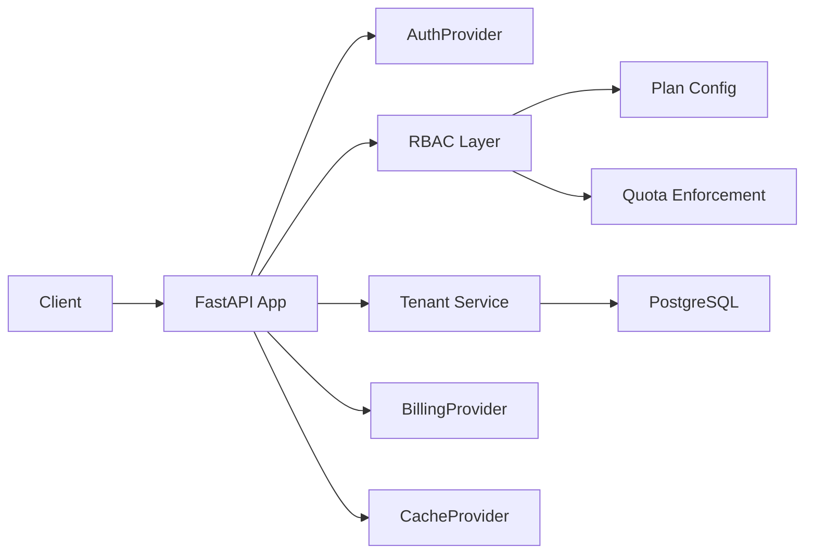

# fastapi-saas-kit

Production-ready FastAPI multi-tenant SaaS boilerplate with pluggable auth, RBAC, organizations, plan limits, quotas, billing gates, rate limiting, tests, Docker, and async architecture.

[](https://www.python.org/downloads/)
[](https://fastapi.tiangolo.com)
[](LICENSE)
[](https://github.com/Devil-nkp/fastapi-saas-kit/actions)
[](https://pypi.org/project/fastapi-saas-kit/)

## Why This Exists

Building a SaaS application from scratch means solving the same infrastructure problems every time:

- Multi-tenant data isolation
- Role-based access control
- Plan limits and quota enforcement
- Billing access gates without vendor lock-in
- Production-ready project structure, tests, and docs

fastapi-saas-kit provides a reusable foundation so you can focus on product code instead of rebuilding SaaS plumbing.

## Features

| Category | What You Get |
|----------|--------------|
| Authentication | Pluggable `AuthProvider` interface, `MockAuthProvider` for development, JWT utilities |
| RBAC | `user`, `org_admin`, and `main_admin` roles with hierarchical access control |
| Multi-tenancy | Organization model, member management, and tenant-scoped data isolation |
| Plans | Configurable `free`, `pro`, and `business` plans with feature gates |
| Quotas | Per-plan usage limits with rolling-window enforcement |
| Billing gates | Pluggable `BillingProvider` interface, mock provider, and payment-provider stub |
| Caching | Pluggable `CacheProvider` interface and in-memory provider |
| Rate limiting | Sliding-window rate limiter with in-memory fallback |
| Security | HSTS, X-Frame-Options, CSP, and XSS protection headers |
| Health checks | `/health` and `/health/ready` endpoints |
| Database | Async PostgreSQL connection pooling and SQL migration runner |
| Docker | Production Dockerfile and local docker-compose setup |
| CI | GitHub Actions lint, compile, and test workflow |
| Tests | Focused pytest suite with mock providers |
| Documentation | Architecture, auth, tenancy, roles, plans, billing, deployment, and API guides |

## Quickstart

### Local Development

```bash
git clone https://github.com/Devil-nkp/fastapi-saas-kit.git
cd fastapi-saas-kit
python -m venv .venv
source .venv/bin/activate  # Windows: .venv\Scripts\activate
pip install -e ".[dev]"
cp .env.example .env
uvicorn fastapi_saas_kit.main:app --reload
```

Open `http://localhost:8000/docs` for the interactive API docs.

### Docker

```bash
git clone https://github.com/Devil-nkp/fastapi-saas-kit.git
cd fastapi-saas-kit
cp .env.example .env
docker compose up
```

## Architecture



The adapter pattern lets you swap providers without changing application code:

| Interface | Development | Production Adapter You Add |
|-----------|-------------|----------------------------|
| `AuthProvider` | `MockAuthProvider` | OIDC, hosted auth, or custom JWT |
| `BillingProvider` | `MockBillingProvider` | Payment processor integration |
| `CacheProvider` | `InMemoryCacheProvider` | Redis, Memcached, or another shared cache |

See [docs/architecture.md](docs/architecture.md) for the full system design.

## Folder Structure

```text
fastapi-saas-kit/
|-- src/fastapi_saas_kit/
|   |-- app.py
|   |-- main.py
|   |-- config.py
|   |-- auth/
|   |-- tenancy/
|   |-- plans/
|   |-- billing/
|   |-- cache/
|   |-- middleware/
|   |-- database/
|   `-- health/
|-- tests/
|-- examples/
|-- docs/
|-- Dockerfile
`-- docker-compose.yml
```

## Authentication

```python
from fastapi import Depends
from fastapi_saas_kit.auth.dependencies import get_current_user, require_plan
from fastapi_saas_kit.auth.models import CurrentUser


@app.get("/profile")
async def profile(user: CurrentUser = Depends(get_current_user)):
    return {"email": user.email, "plan": user.plan}


@app.get("/premium")
async def premium(user: CurrentUser = Depends(require_plan("pro"))):
    return {"message": "Premium content"}
```

See [docs/authentication.md](docs/authentication.md).

## Multi-tenancy

Organizations provide tenant isolation:

```python
@app.get("/my-data")
async def my_data(user: CurrentUser = Depends(get_current_user)):
    data = await db.fetch(
        "SELECT * FROM projects WHERE organization_id = $1",
        user.organization_id,
    )
    return {"data": data}
```

See [docs/multi-tenancy.md](docs/multi-tenancy.md).

## Roles and Permissions

```python
from fastapi import Depends
from fastapi_saas_kit.auth.dependencies import require_main_admin, require_org_admin


@app.get("/admin/users")
async def admin_panel(user=Depends(require_main_admin())):
    return {"scope": "platform"}


@app.get("/org/settings")
async def org_settings(user=Depends(require_org_admin())):
    return {"scope": "organization"}
```

See [docs/roles.md](docs/roles.md).

## Plans and Quotas

```python
from fastapi import Depends
from fastapi_saas_kit.auth.dependencies import get_current_user
from fastapi_saas_kit.plans.quota import check_quota


@app.post("/projects")
async def create_project(user=Depends(get_current_user)):
    await check_quota(user, "projects", current_usage=3)
    return {"created": True}
```

See [docs/plans-and-quotas.md](docs/plans-and-quotas.md).

## Billing Gates

```python
from fastapi_saas_kit.billing.adapters.mock import MockBillingProvider
from fastapi_saas_kit.billing.router import configure_billing


configure_billing(MockBillingProvider())
```

Live payment integrations are intentionally adapter-based. The project includes interfaces and stubs, not real payment credentials or business-specific billing code.

See [docs/billing-gates.md](docs/billing-gates.md).

## Example Usage

```bash
curl http://localhost:8000/health
curl -H "Authorization: Bearer mock-user-001" http://localhost:8000/billing/status
curl -H "Authorization: Bearer mock-main-admin-001" http://localhost:8000/orgs/
```

Example apps are available in:

- [examples/basic_saas](examples/basic_saas)
- [examples/multi_tenant_app](examples/multi_tenant_app)

## Running Tests

```bash
pip install -e ".[dev]"
python -m compileall src
pytest
ruff check src tests
```

## Deployment

```bash
docker compose up
docker build -t my-saas .
docker run -p 8000:8000 -e DATABASE_URL="postgresql://..." -e ENVIRONMENT="production" my-saas
```

See [docs/deployment.md](docs/deployment.md).

## Roadmap

- Redis cache adapter
- Full payment provider adapter examples
- OAuth2 / OIDC auth adapter
- Email notification interface
- Machine-to-machine authentication
- Feature flags system
- Admin dashboard template

See [ROADMAP.md](ROADMAP.md).

## Contributing

Contributions are welcome. See [CONTRIBUTING.md](CONTRIBUTING.md).

## Security

For security issues, see [SECURITY.md](SECURITY.md). Please do not open public issues for vulnerabilities.

## License

MIT License - see [LICENSE](LICENSE).
