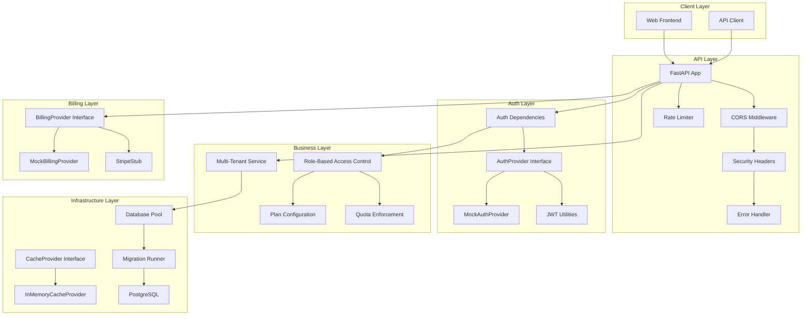

# Architecture

## System Overview

fastapi-saas-kit uses an **adapter-based architecture** that separates business logic from infrastructure providers. This allows you to swap out authentication, billing, caching, and database providers without changing your application code.

## Architecture Diagram



## Key Design Principles

### 1. Adapter Pattern

Every external service is accessed through an abstract interface:

| Interface | Purpose | Included Adapters |
|-----------|---------|-------------------|
| `AuthProvider` | Authentication & identity | `MockAuthProvider` |
| `BillingProvider` | Payment processing | `MockBillingProvider`, `StripeStub` |
| `CacheProvider` | Data caching | `InMemoryCacheProvider` |

### 2. Dependency Injection

FastAPI's dependency injection system is used for:
- **Authentication**: `get_current_user` resolves the user from the request
- **Authorization**: `require_role()`, `require_plan()` gate access
- **Rate Limiting**: `rate_limit_ip()`, `rate_limit_user()` enforce limits

### 3. Tenant Isolation

All data access is scoped by `organization_id`:
- Users can only access their own organization's data
- Org admins can manage their organization only
- Main admins have cross-tenant access

### 4. Configuration

All settings use Pydantic's `BaseSettings` with environment variable loading:
- Type-safe configuration
- Validation at startup
- `.env` file support for development

## Module Structure

```
src/fastapi_saas_kit/
├── app.py              # App factory — assembles everything
├── config.py           # Pydantic settings
├── auth/               # Authentication & RBAC
├── tenancy/            # Multi-tenant organizations
├── plans/              # Plan config & quotas
├── billing/            # Payment processing
├── cache/              # Caching layer
├── middleware/          # Rate limiting, security, errors
├── database/           # Connection pool & migrations
└── health/             # Health check endpoints
```
