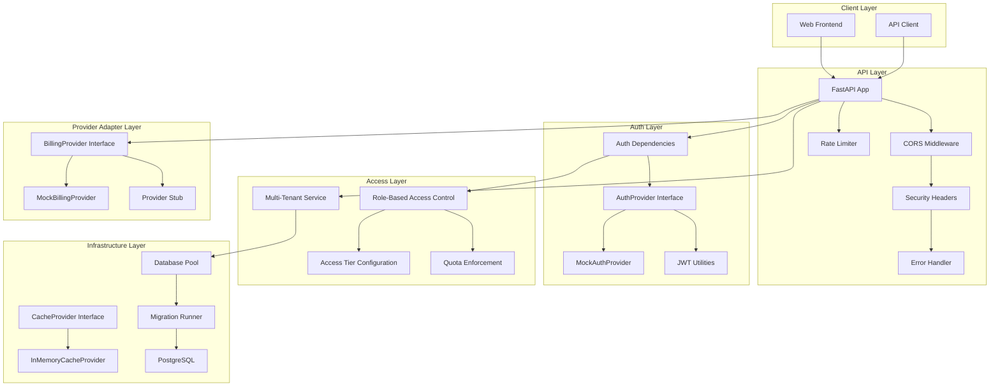

# Architecture

## System Overview

fastapi-saas-kit uses an adapter-based architecture for a production-ready FastAPI backend foundation. Authentication, access control, provider adapters, caching, and database access are separated behind clear interfaces so you can replace infrastructure without rewriting route logic.

## Architecture Diagram



## Key Design Principles

### 1. Adapter Pattern

External services are accessed through abstract interfaces:

| Interface | Purpose | Included Adapters |
|-----------|---------|-------------------|
| `AuthProvider` | Authentication and identity | `MockAuthProvider` |
| `BillingProvider` | Access events and entitlement adapter | `MockBillingProvider`, provider stub |
| `CacheProvider` | Data caching | `InMemoryCacheProvider` |

`BillingProvider` remains the stable code interface name. Public usage can treat it as a provider adapter for access gates, entitlements, and external event handling.

### 2. Dependency Injection

FastAPI dependency injection is used for:

- Authentication: `get_current_user` resolves the user from the request
- Authorization: `require_role()` and `require_plan()` gate access
- Rate limiting: `rate_limit_ip()` and `rate_limit_user()` enforce request limits

### 3. Tenant Isolation

All data access is scoped by `organization_id`:

- Users can only access their own organization's data
- Org admins can manage their organization only
- Main admins have cross-tenant access

### 4. Configuration

All settings use Pydantic's `BaseSettings` with environment variable loading:

- Type-safe configuration
- Validation during application initialization
- `.env` file support for development

## Module Structure

```text
src/fastapi_saas_kit/
|-- app.py              # App factory
|-- config.py           # Pydantic settings
|-- auth/               # Authentication and RBAC
|-- tenancy/            # Multi-tenant organizations
|-- plans/              # Access tier config and quotas
|-- billing/            # Provider adapter interface and routes
|-- cache/              # Caching layer
|-- middleware/         # Rate limiting, security, errors
|-- database/           # Connection pool and migrations
`-- health/             # Health check endpoints
```
